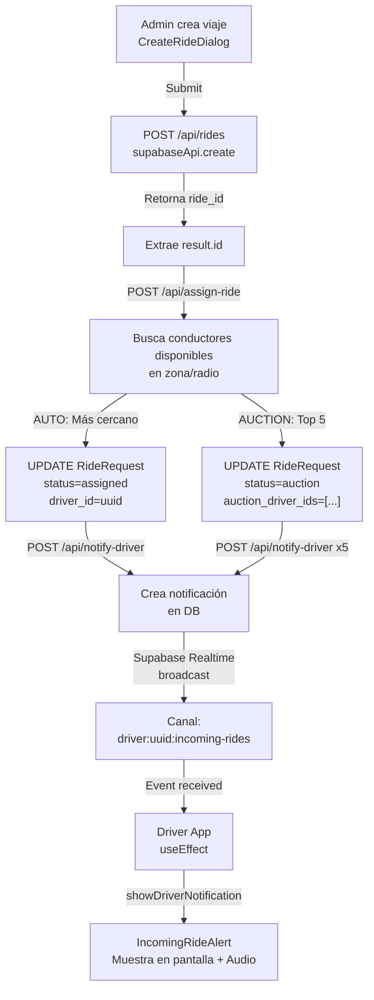

# Sistema de Asignación de Viajes - Documentación

## Overview

Se ha implementado un sistema completo de asignación automática de viajes que conecta la creación de viajes en el panel administrativo con conductores disponibles en tiempo real.

**Fecha de implementación:** 2024
**Commit:** feat: Implement ride assignment and driver notification system

## Cambios Implementados

### 1. **Nuevo Endpoint: `/api/assign-ride`** ✅
**Archivo:** `/app/api/assign-ride/route.ts`

Endpoint POST que maneja la asignación inteligente de viajes a conductores.

**Funcionalidad:**
- Recibe: `{ ride_id: string, assignment_mode: "auto" | "auction" | "manual" }`
- Busca conductores disponibles cercanos al pickup location
- Soporta dos modos de asignación:
  - **AUTO ASSIGN:** Asigna automáticamente al conductor más cercano
  - **AUCTION:** Envia oferta a los primeros 5 conductores en el radio configurado
- Actualiza `RideRequest` con `driver_id` y cambia status a `assigned`
- Notifica al conductor via endpoint `/api/notify-driver`

**Lógica de búsqueda de conductores:**
1. Intenta usar RPC `find_nearby_drivers()` (require función SQL en Supabase)
2. Si falla, fallback a query simple en tabla `Driver`
3. Filtra: `status = 'available'` y `approval_status = 'approved'`
4. Selecciona el más cercano por distancia

**Respuestas:**
```json
// Success - Auto Assign
{
  "success": true,
  "mode": "auto_assign",
  "driver_id": "uuid",
  "driver_name": "Juan García",
  "message": "Driver assigned successfully"
}

// Success - Auction
{
  "success": true,
  "mode": "auction",
  "drivers_notified": 5,
  "message": "Auction set for 5 drivers"
}

// No drivers available
{
  "success": false,
  "mode": "auto_assign",
  "requiresManualAssignment": true,
  "message": "No available drivers found in the service area"
}
```

### 2. **Nuevo Endpoint: `/api/notify-driver`** ✅
**Archivo:** `/app/api/notify-driver/route.ts`

Endpoint POST que envía notificaciones a conductores en tiempo real.

**Funcionalidad:**
- Recibe: `{ driver_id, ride_id, notification_type, message, ride_data }`
- Crea registro en tabla `DriverNotifications` (si existe)
- Envía broadcast vía Supabase Realtime al canal `driver:${driver_id}:incoming-rides`
- Tipos de notificación: `ride_assigned`, `ride_offer`, `ride_cancelled`

**Broadcasting Structure:**
```json
{
  "event": "new_ride_notification",
  "payload": {
    "ride_id": "uuid",
    "driver_id": "uuid", 
    "notification_type": "ride_assigned",
    "message": "Viaje asignado: Calle Principal 123",
    "ride_data": {
      "pickup_address": "Calle Principal 123",
      "dropoff_address": "Avenida Secundaria 456",
      "estimated_price": 150.00,
      "passenger_name": "Carlos López"
    },
    "timestamp": "2024-01-15T10:30:00Z"
  }
}
```

### 3. **Actualización: `CreateRideDialog.tsx`** ✅
**Archivo:** `/components/admin/CreateRideDialog.tsx`

Después de crear un viaje exitosamente:
1. Captura el `result.id` del viaje creado
2. Llama a `/api/assign-ride` con `ride_id` y `assignment_mode`
3. Maneja respuestas:
   - ✅ **Asignado:** Muestra nombre del conductor
   - ⚠️ **No disponible:** Muestra advertencia de asignación manual requerida
   - ❌ **Error:** Notifica usuario pero NO cancela el viaje (fue creado exitosamente)

**Flujo:**
```
Admin crea viaje → Viaje guardado en DB → Se llama /api/assign-ride → 
Conductor buscado y asignado → Se notifica conductor → Dialog cierra
```

**Mensajes de usuario:**
- ✅ `"✅ Viaje asignado a conductor: [Nombre]"`
- ⚠️ `"⚠️ No hay conductores disponibles - asignación manual requerida"`
- ℹ️ `"Viaje creado pero la asignación automática falló"`

### 4. **Actualización: `app/driver-app/page.tsx`** ✅
**Archivo:** `/app/driver-app/page.tsx`

Nuevo `useEffect` que suscribe al canal de notificaciones en tiempo real:

**Canal Realtime:**
- Nombre: `driver:${driver.id}:incoming-rides`
- Evento: `new_ride_notification` (broadcast)
- Triggered por: `/api/notify-driver`

**Manejo de notificaciones:**
1. **Escucha broadcast** del canal asignado específico del conductor
2. **Valida** que la notificación sea para este conductor
3. **Invalida cache** de React Query para refetch de viajes
4. **Muestra notificación visual** con audio (alarm)
5. **Inicia timer** para timeout de aceptación (por defecto 30s)
6. Tipos soportados:
   - `ride_assigned`: Viaje directamente asignado
   - `ride_offer`: Viaje en modo auction (oferta con timeout)

**Timeline:**
```
Conductor A conecta a driver-app → Se conecta al canal Realtime →
Admin crea viaje → /api/assign-ride envía notificación a Conductor A →
/api/notify-driver hace broadcast en Realtime → 
useEffect de driver-app recibe evento → 
Muestra IncomingRideAlert con audio
```

## Flujo Completo de Asignación



## Configuración Requerida en AppSettings

Para que el sistema funcione correctamente, se necesitan estos campos en la tabla `AppSettings`:

| Campo | Tipo | Default | Descripción |
|-------|------|---------|-------------|
| `auto_assign_nearest_driver` | boolean | true | Habilita auto-asignación |
| `auction_mode_enabled` | boolean | false | Habilita modo auction |
| `auction_primary_radius_km` | integer | 10 | Radio para búsqueda de conductores en auction |
| `auction_timeout_seconds` | integer | 30 | Timeout para que conductor acepte oferta |
| `driver_location_update_interval_seconds` | integer | 20 | Cada cuánto actualiza ubicación |

## Tablas Requeridas

### Table: `DriverNotifications` (Opcional pero recomendado)

```sql
CREATE TABLE IF NOT EXISTS DriverNotifications (
  id UUID PRIMARY KEY DEFAULT gen_random_uuid(),
  driver_id UUID NOT NULL REFERENCES Driver(id),
  ride_id UUID NOT NULL REFERENCES RideRequest(id),
  type TEXT NOT NULL, -- 'ride_offer', 'ride_assigned', 'ride_cancelled'
  message TEXT,
  data JSONB,
  read BOOLEAN DEFAULT false,
  created_at TIMESTAMP DEFAULT now(),
  updated_at TIMESTAMP DEFAULT now()
);

CREATE INDEX idx_driver_notifications_driver_id 
ON DriverNotifications(driver_id);
CREATE INDEX idx_driver_notifications_ride_id 
ON DriverNotifications(ride_id);
```

### Función SQL Recomendada: `find_nearby_drivers()`

```sql
CREATE OR REPLACE FUNCTION find_nearby_drivers(
  latitude FLOAT8,
  longitude FLOAT8,
  radius_km FLOAT8,
  status TEXT DEFAULT 'available'
)
RETURNS TABLE (
  id UUID,
  full_name TEXT,
  latitude FLOAT8,
  longitude FLOAT8,
  email TEXT,
  distance_km FLOAT8
) AS $$
BEGIN
  RETURN QUERY
  SELECT 
    d.id,
    d.full_name,
    d.latitude,
    d.longitude,
    d.email,
    (
      6371 * acos(
        cos(radians(latitude)) * cos(radians(d.latitude)) *
        cos(radians(d.longitude) - radians(longitude)) +
        sin(radians(latitude)) * sin(radians(d.latitude))
      )
    ) AS distance_km
  FROM Driver d
  WHERE 
    d.status = status
    AND d.approval_status = 'approved'
    AND d.latitude IS NOT NULL
    AND d.longitude IS NOT NULL
  HAVING (
    6371 * acos(
      cos(radians(latitude)) * cos(radians(d.latitude)) *
      cos(radians(d.longitude) - radians(longitude)) +
      sin(radians(latitude)) * sin(radians(d.latitude))
    )
  ) <= radius_km
  ORDER BY distance_km ASC
  LIMIT 20;
END;
$$ LANGUAGE plpgsql;
```

## Logs Importantes

El sistema emite logs detallados para debugging:

```
[ASSIGN-RIDE] Processing ride {ride_id} with mode: auto
[ASSIGN-RIDE] Found 8 drivers via RPC
[ASSIGN-RIDE] Assigning to driver {driver_id}
[ASSIGN-RIDE] ✅ Ride assigned to driver {driver_id}

[NOTIFY-DRIVER] Notifying driver {driver_id} about ride {ride_id}
[NOTIFY-DRIVER] ✅ Notification sent via driver:{driver_id}:incoming-rides

[CreateRideDialog] Viaje creado exitosamente: {ride_id}
[CreateRideDialog] Iniciando asignación de conductor
[CreateRideDialog] ✅ Conductor asignado: {driver_id}

[DRIVER-APP] Received incoming ride notification: {payload}
```

## Testing Manual

### Scenario 1: Auto-Assign
1. Admin: Crear viaje con `assignment_mode="auto"`
2. Sistema asigna al conductor más cercano
3. Conductor recibe notificación visual y audio
4. Viaje aparece en lista del conductor

### Scenario 2: Auction Mode
1. Admin: Crear viaje con `assignment_mode="auction"`
2. Sistema notifica a top 5 conductores
3. Primer conductor que acepta obtiene el viaje
4. Otros conductores ven viaje como "tomado" después de timeout

### Scenario 3: Manual Assignment
1. Admin: Crear viaje con `assignment_mode="manual"`
2. No se asigna automáticamente
3. Admin debe asignar manualmente desde UI (si existe función)

## Posibles Errores y Soluciones

| Error | Causa | Solución |
|-------|-------|----------|
| `No available drivers` | No hay conductores en status 'available' | Verificar que conductores tengan status correcto |
| `Ride not found` | ride_id inválido o no existe | Verificar que ride_id sea válido UUID |
| RPC error | Función SQL no existe | Crear función `find_nearby_drivers()` |
| Notificación no recibida | Conductor desconectado Realtime | Reconectar driver app |
| driver_id NULL | Asignación no se ejecutó | Verificar logs de /api/assign-ride |

## Performance Considerations

- **RPC fallback:** Si RPC falla, revierte a query SQL simple (más lento pero funciona)
- **Realtime broadcast:** Se envía a canal específico del conductor (eficiente)
- **Polling + Realtime:** Driver app ahora tiene ambos mecanismos:
  - Realtime para notificaciones instantáneas
  - Polling cada 15s como fallback
- **Timeout default:** 30 segundos para que conductor acepte (configurable)

## Próximos Pasos Recomendados

1. ✅ Crear tabla `DriverNotifications` en Supabase
2. ✅ Crear función SQL `find_nearby_drivers()`
3. ✅ Verificar AppSettings tiene campos de configuración
4. ✅ Testing manual de flujo completo
5. ⚠️ Monitorear logs en producción
6. 📊 Agregar métricas de tasa de asignación exitosa

## Archivo de Cambios

```
Modified:
  - components/admin/CreateRideDialog.tsx (agregó llamada a assign-ride)
  - app/driver-app/page.tsx (agregó Realtime listener)

Created:
  - app/api/assign-ride/route.ts
  - app/api/notify-driver/route.ts
```

---

**Implementación completada y compilación exitosa ✅**
